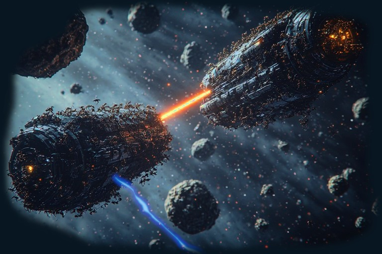

Bienvenue dans les 24h du Code 2026 !

Vous allez affronter les autres équipes
dans un univers spatial en pilotant une flotte de vaisseaux. À vous d'écrire le
code qui les fera survivre — et vaincre.

    
    Marabunta - Bataille spatiale

Vue d'ensemble
==============

Votre programme communique avec le serveur de jeu via une connexion **WebSocket**.
Toutes les commandes que vous envoyez et tous les événements que vous recevez
transitent par ce canal sous forme de messages **JSON**.

L'univers est un **tore** (une grille dont les bords se rejoignent) : sortir
d'un côté vous fait réapparaître de l'autre. Les coordonnées que vous recevez
sont toujours **relatives** à la position de votre vaisseau.

La partie se joue jusqu'à ce qu'il ne reste plus qu'une seule équipe en vie.

Connexion et démarrage
=======================

Toutes les connexions se font sur le point d'accès WebSocket ``/ws`` du serveur.

Étape 1 — Hello
---------------

Dès la connexion, le serveur envoie automatiquement :

.. code-block::

   < {"type": "hello"}

Étape 2 — Enregistrement de la flotte
---------------------------------------

Envoyez un message ``start`` pour créer votre flotte et réserver vos vaisseaux
dans le lobby :

.. code-block::

   > {
       "type": "start",
       "team": "NomDeVotreEquipe",
       "vessels": [
           [H, A, S, R],
           [H, A, S, R],
           ...
       ]
     }

Chaque sous-tableau ``[H, A, S, R]`` décrit les statistiques d'un vaisseau
(voir la section :ref:`stats`). Le serveur répond avec les identifiants secrets
de vos vaisseaux :

.. code-block::

   < {"type": "new_vessels", "vessels": ["Equipe:1:xKpQa", "Equipe:2:mNrTs"]}

.. warning::

   Ces identifiants contiennent un token secret. **Ne les partagez pas.**

.. note::

   Si vous renvoyez un message ``start``, votre ancienne flotte est détruite.

Contraintes sur la flotte :

- De **1 à 6** vaisseaux.
- Chaque statistique est un entier entre **0 et 9**.
- La **somme totale** de toutes les statistiques de tous les vaisseaux ne doit
  pas dépasser **30**.

Étape 3 — Connexion à chaque vaisseau
--------------------------------------

Ouvrez **une connexion WebSocket par vaisseau** et envoyez :

.. code-block::

   > {"type": "connect", "id": "Equipe:1:xKpQa"}

.. note::

   Évidemment, adaptez l'``id`` avec les identifiants renvoyés par le message ``new_vessels``.

Le serveur répond avec les statistiques effectives du vaisseau :

.. code-block::

   < {"type": "stats", "stats": [H, A, S, R], "hp": 21}

Puis, lorsque la bataille commence (dès qu'au moins deux équipes sont dans le
lobby depuis 5 secondes) :

.. code-block::

   < {"type": "start_battle"}

.. note::

   Si vous vous connectez à un vaisseau après le début d'une partie, le message
   ``start_battle`` est envoyé à la connexion pour vous informer que la partie
   est en cours.

.. _stats:

Statistiques des vaisseaux
===========================

Chaque vaisseau est défini par quatre statistiques, chacune de 0 à 9.
La somme cumulée de toutes les stats de votre flotte ne doit pas dépasser **30**.

.. list-table::
   :header-rows: 1
   :widths: 10 15 75

   * - Stat
     - Nom
     - Effet
   * - H
     - Points de vie
     - Détermine la résistance aux dégâts. Plus la valeur est haute, plus le
       vaisseau peut encaisser.
   * - A
     - Attaque / Portée
     - Augmente la portée des armes (torpille, laser, IEM).
   * - S
     - Vitesse
     - Augmente la distance maximale qui peut être parcourue à chaque commande
       de déplacement.
   * - R
     - Radar
     - Augmente le rayon de détection du radar actif et passif.

Il n'y a pas de bonne ou mauvaise répartition : à vous de choisir l'équilibre
qui correspond à votre stratégie.

Énergie
=======

Chaque vaisseau possède une **réserve d'énergie** (maximum : 100).
L'énergie se régénère automatiquement au fil du temps.
Si vous n'avez pas assez d'énergie pour une action, le serveur envoie :

.. code-block::

   < {"type": "low_energy"}

Coût des actions :

.. list-table::
   :header-rows: 1
   :widths: 30 15

   * - Action
     - Coût
   * - ``move``
     - 5 (max, proportionnel à la distance)
   * - ``fire_torpedo``
     - 10
   * - ``drop_mine``
     - 10
   * - ``fire_iem``
     - 30
   * - ``fire_laser``
     - 50
   * - ``scan_radar``
     - 1

L'énergie peut aussi être récupérée en passant sur des **ressources** laissées
par les vaisseaux détruits (voir :ref:`ressources`).

Commandes du vaisseau
======================

Les commandes ne sont actives qu'une fois ``start_battle`` reçu.
Si votre vaisseau est sous l'effet d'un IEM, toute commande reçoit :

.. code-block::

   < {"type": "iem_freeze"}

move
----

Déplace le vaisseau dans une direction. La direction est un vecteur d'entiers
de la même dimension que l'univers.

.. code-block::

   > {"type": "move", "direction": [dx, dy]}
   > {"type": "move", "direction": [dx, dy, dz]}       (3D)
   > {"type": "move", "direction": [dx, dy, dz, dw]}   (4D)

.. note::

   La norme (Manhattan) du vecteur ne doit pas dépasser votre capacité de
   déplacement (déterminée par la stat **S**). Si le déplacement est trop
   grand, le serveur renvoie ``{"type": "move_aborded"}``.

.. note::

   Les autres vaisseaux reçoivent un signal ``passive_scan`` contenant votre
   déplacement s'ils sont à portée de radar.

fire_torpedo
------------

Tire une torpille dans la direction donnée.

.. code-block::

   > {"type": "fire_torpedo", "direction": [dx, dy]}

La torpille se déplace chaque tick, inflige **20 dégâts** au premier vaisseau
touché, et est détruite par les astéroïdes et les mines.

drop_mine
---------

Pose une mine à votre position actuelle.

.. code-block::

   > {"type": "drop_mine", "delay": 3.0}

Le paramètre ``delay`` définit le temps en secondes avant que la
mine ne soit armée. Une mine détruite provoque une explosion qui peut faire
réagir les mines voisines en chaîne.

fire_laser
----------

Tire un rayon laser instantané dans la direction donnée.

.. code-block::

   > {"type": "fire_laser", "direction": [dx, dy]}

Le laser traverse les cellules en ligne droite jusqu'à la portée maximale
(déterminée par la stat **A**). Il inflige **20 dégâts** au premier vaisseau
touché et est stoppé par les astéroïdes, les ressources et les mines.

fire_iem
--------

Tire une impulsion électromagnétique (IEM) dans la direction donnée.

.. code-block::

   > {"type": "fire_iem", "direction": [dx, dy]}

L'IEM gèle **tous les vaisseaux ennemis** sur sa trajectoire pendant **5
secondes**. La portée dépend de la stat **A**.

scan_radar
----------

Effectue un scan actif autour de votre vaisseau.

.. code-block::

   > {"type": "scan_radar"}

Pour chaque objet détecté dans votre rayon radar, vous recevez :

.. code-block::

   < {
       "type": "active_scan",
       "what": "vessel" | "asteroid" | "mine" | "torpedo" | "farmable",
       "position": [dx, dy]
     }

Les positions sont **relatives** à votre vaisseau.

autodestruction
---------------

Déclenche l'autodestruction immédiate du vaisseau.

.. code-block::

   > {"type": "autodestruction"}

Inflige **20 dégâts** à tous les vaisseaux et détruit les mines dans un rayon
de 5. La connexion WebSocket est fermée après.

Événements reçus (non sollicités)
===================================

Le serveur peut vous envoyer des messages à tout moment, indépendamment de vos
commandes.

damage
------

Votre vaisseau vient de subir des dégâts.

.. code-block::

   < {"type": "damage", "hp": 42}

``hp`` est votre niveau de vie actuel. Si ``hp`` atteint **0**, votre vaisseau
est détruit et la connexion fermée.

passive_scan
------------

Votre radar a détecté un événement à proximité.

.. code-block::

   < {"type": "passive_scan", "what": "explosion", "position": [dx, dy]}
   < {"type": "passive_scan", "what": "move", "vessel": "Equipe:3", "movement": [dx, dy]}

- ``explosion`` : une explosion s'est produite à cette position relative.
- ``move`` : un vaisseau (identifié par son nom d'équipe et numéro) s'est
  déplacé d'un certain vecteur. **La position absolue n'est pas fournie.**

resource_depleted
-----------------

Une ressource sur laquelle vous passiez vient d'être entièrement récupérée.

.. code-block::

   < {"type": "resource_depleted"}

iem_freeze
----------

Votre vaisseau est gelé par un IEM et ne peut pas agir.

.. code-block::

   < {"type": "iem_freeze"}

low_energy
----------

Vous n'avez pas assez d'énergie pour effectuer l'action demandée.

.. code-block::

   < {"type": "low_energy"}

start_battle
------------

La bataille a commencé.

.. code-block::

   < {"type": "start_battle"}

won / end
---------

La partie est terminée.

.. code-block::

   < {"type": "won"}   -- votre équipe a gagné
   < {"type": "end"}   -- partie terminée (vous avez perdu)

La connexion WebSocket est fermée juste après.

.. _ressources:

Ressources
===========

Lorsqu'un vaisseau est détruit, il laisse une **ressource** à sa position.
En vous déplaçant sur cette case, votre vaisseau récupère de l'énergie
progressivement, jusqu'à épuisement de la ressource.

Objets de l'univers
====================

.. list-table::
   :header-rows: 1
   :widths: 20 80

   * - Objet
     - Description
   * - Vaisseau
     - Votre vaisseau ou celui d'un adversaire.
   * - Astéroïde
     - Obstacle indestructible. Tout vaisseau qui le percute est instantanément
       détruit. Stoppe les torpilles et les lasers.
   * - Torpille
     - Projectile se déplaçant à vitesse fixe. Inflige 20 dégâts au premier
       vaisseau touché.
   * - Mine
     - Explosive au contact (une fois armée). Inflige 20 dégâts et peut
       déclencher les mines voisines (rayon 5) en chaîne.
   * - Ressource
     - Dépôt d'énergie récupérable en passant dessus.

Collisions entre vaisseaux
===========================

Si deux vaisseaux se retrouvent sur la même case, ils infligent chacun **15
dégâts** à l'autre.

Ping-pong
=========

Disponible avant et pendant la partie, pour vérifier la connexion. Totalement
inutile, donc parfaitement indispensable.

.. code-block::

   > {"type": "ping"}
   > {"type": "ping", "n": 42}
   < {"type": "pong", "n": 42}
